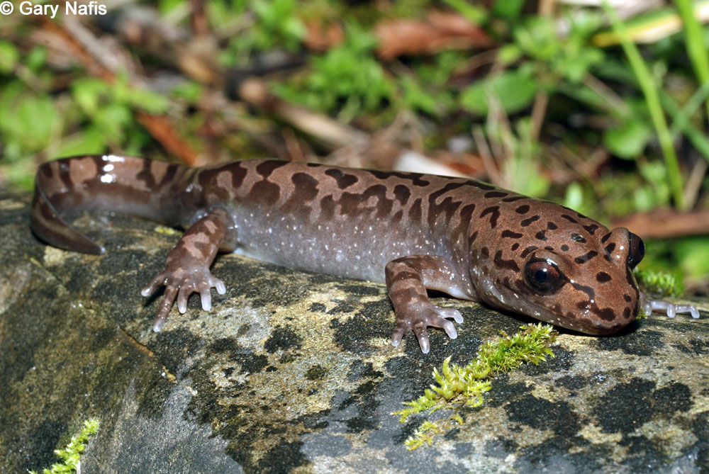

```{r setup, include=FALSE}
knitr::opts_chunk$set(
  echo = FALSE,
  message = FALSE,
  warning = FALSE)
```

```{r}
# load packages ------------------------------------------------------------------

library(tidyverse)
library(janitor)
library(dplyr)
library(kableExtra)
library(ggbeeswarm)
library(car)
library(effsize)

# add data -------------------------------------------------------------------------

mack_creek_verts <- read_csv("mack_creek_vertebrates.csv") %>% 
  clean_names()

```


### Introduction
Beginning in 1993, researchers from the [Andrews Experimental Forest Long-Term Ecological Research (LTER)](https://andrewsforest.oregonstate.edu) have been monitoring populations of Pacific Giant Salamanders, *Dicamptodon tenebrosus*, specifically in Mack Creek (Gregory 2016). The Experimental Forest is part of the Willamette National Forest in western Oregon and managed by the U.S. Forest Service and Oregon State University (Figure 2.). Researchers are interested in how disturbances in forests effect biota. The data was collected from two sections of of Mack Creek - a forest clear cut in 1963 and a 500 year old growth coniferous forest. Here, we will use the data collected by the Andrews Experimental Forest Team to compare the differences in size and weight distributions of salamanders from clear cut and old growth sections. 

 

***Figure 1.** A Pacific Giant Salamander (Dicamptodon tenebrosus) laying on a down log. Photo credit: Gary Nafis, [www.californiaherps.com](http://www.californiaherps.com/salamanders/pages/d.tenebrosus.html).*


***Figure 2.** Map of HJ Andrews Experimental Forest LTER in Oregon. Andrews Experimental Forest is managed by the U.S. Forest Service and Oregon State University. Map courtesty of: [HJ Andrews Experimental Forest](https://andrewsforest.oregonstate.edu/sites/default/files/lter/data/map/2011base.jpg).* 

### Data and Methods

Data for salamander counts and weights were annually collected since 1993 in two 150 meter reaches within Mack Creek. The lower reach is in a clear cut forest, while the upper reach is in an old growth forest. The reaches were divided into three 50 meter sections blocked off by nets, then each 50 m section was sampled with two-pass electrofishing (Gregory 2016). All vertebrates captured were measured and weighed. Channel measurements, such as channel type, were aso recorded. For more information on collection methods and spatial information, please refer to the [metadata](https://portal.edirepository.org/nis/mapbrowse?scope=knb-lter-and&identifier=4027&revision=12).

Trends in salamander counts from 1993-2017 were visually compared in clear cut and old growth reaches. Salamander counts were then compared using a Pearson's chi-square test to determine if salamander counts differed statistically by channel type (cascade, pool, side channel; $\alpha$ = 0.05 throughout). 2017 salamander weights were compared in clear cut and old growth forest sections and in three different channel types using a two sample t test and an ANOVA, respectively, to determine if mean weights differed sigifnicantly by reach section and or channel type. To measure the maginitude of the difference between the means, we calculated the effect size using Cohen's d. All analyses and figures were prepared using R software version 3.6.1. Collaboration between authors was done using GitHub. 


### Results

#### Results A: Annual salamander counts in old growth and clear cut sections of Mack Creek

Salamander counts in old growth and clear cut sections were compared between 1993 and 2017. Overall, salamander counts in both sections followed similar patterns; when counts in old-growth sections increased, counts in clear cut sections also increased. Similarly, when counts of salamanders in old-growth sections decreased, salamander counts in clear cut sections also decreased. Likely, environmental factors affect annual variability in salamander counts. 

Generally, salamander observations were higher in old growth forest. However, in 1994 and 2015-2017, salamander counts were higher in clear cut sections. Between 1993 and 2017, salamander counts in the clear cut and od growth forests increased by 129% and 154%, respectively. Throughout the study period, salamander counts in the clear cut section reached a high of 368 in 2017 and a low of 137 in 2014. Comparatively, salamder counts in the old growth section reached a high of 380 in 2002 and a low of 129 in 1993. In general, salamader counts have been increasing since the study began in 1993. 


```{r}
# subdata: remove unneccessary columns and keep only salamander observations
salamander_counts_data <- mack_creek_verts %>% 
  filter (species == "DITE") %>% 
  select (year, section, species)

# count number of salamanders in each section (CC vs OG) for every year
salamander_counts <- salamander_counts_data %>% 
  group_by(year, section) %>% 
  count(species) %>%
  mutate(section_long = case_when(
    section %in% "CC" ~ "Clear Cut",
    section %in% "OG" ~ "Old Growth"))

# totalling counts of salamanders in CC and OG sections for result descriptions
salamander_counts_totals <- salamander_counts %>%
  group_by(section) %>%
  summarize(total_pop = sum(n))

# Graph of salamander counts
ggplot(salamander_counts, aes(x = year, y = n)) +
  geom_line(aes(color = section_long), size = 1) +
  geom_point(aes(color = section_long), size = 2) +
  scale_x_continuous(lim = c(1993, 2017),
                     expand = c(0, 0),
                     breaks = seq(1993, 2017, by = 2)) +
  scale_y_continuous(lim=c(0, 400),
                     expand=c(0,0),
                     breaks=seq(100, 400, by=100)) +
   scale_color_manual(name="Creek Section", values = c("orange", "seagreen")) +
  theme_bw() +
  labs(x = "\nYear",
       y = "Annual Salamander Counts\n",
       title = "Salamander Count in Clear Cut and Old Growth Sections\n") +
    theme(plot.title = element_text(hjust=0.5))
  

# I can't figure out how to change the title of the legend!?!? ah ha! got it! I was trying to figure this same thing out earlier and couldnt get it

```

***Figure 3.** Annual salamander counts in clear cut (orange) and old growth (green) sections of Mack Creek. Old growth sections are responsible for higher counts of salamanders for 80% of the time between 1993 and 2017. The populations in both sections display similar patterns of highs and lows. Data: Stanley Gregory, Andrews Forest LTER Sites.* 

#### Results B: Table of 2017 salamander counts by channel classification 

***Table 1.** Salamander counts in different channel types (cascade, ool, and side channel) in clear cut and old-growth forests. Data: Stanley Gregory, Andrews Forest LTER Sites.*
```{r}
# Table of 2017 salamander counts by channel classification (pool, cascades and side-channel) in old growth and clear cut sections of Mack Creek.

#subdata: only include 2017 and salamader observations, exclude isolated pools from data
salamander_channel_2017 <- mack_creek_verts %>% 
  filter (year == "2017") %>% 
  filter (species == "DITE") %>% 
  filter (unittype != "IP") %>% 
  mutate(channel_type= case_when(
    unittype %in% "C" ~ "Cascade",
    unittype %in% "P" ~"Pool",
    unittype %in% "SC" ~ "Side Channel"
  )) %>% 
  select (species, channel_type, section)

# counts
salamander_channel_counts_2017 <- salamander_channel_2017 %>% 
  group_by(channel_type, section) %>% 
  count(species) %>% 
  select (channel_type, section, n)

# create contigency table 
salamander_table_2017 <- salamander_channel_counts_2017 %>% 
  pivot_wider(names_from = section, values_from = n) 
  

# add proportions to contigency table
salamander_table_counts_proportions_2017 <- salamander_table_2017 %>% 
  adorn_percentages(denominator = "row") %>% 
  adorn_pct_formatting(digits=1) %>% 
  adorn_ns(position = "front")

#  markdown ready table
salamander_table_counts_proportions_2017 %>% 
  kable (col.names = c("Channel Type", "Clear Cut Forest", "Old-Growth Forest")) %>%
  kable_styling(bootstrap_options = c("striped", "hover", "condensed", "responsive"))


```

Salamander counts in clear cut sections were higher in cascades (n~cascade~ = 247 (55.1%)) and side channels (n~sidechannel~ = 90 (54.9%)). In old-growth sections, pools had higher counts of salamanders (n~pool~ = 45 (59.2%)). 

#### Results C: Is there a significant difference in salamander counts in channel locations in old growth and clear cut forests?

```{r, include = FALSE}
# Chi-Square test to determine if there is a significant difference in what channel Pacific giant salamanders are located (pool, cascade or side channel) between the two old growth and clear cut forests

# Null Hypothesis: There is no siginificant difference in what channel Pacific giant salamander are located between old growth and clear cut forests

# Alternative Hypothesis: There is a significant difference in what channel Pacific giant salamander are located between old growth and clear cut forests


# first, get a contingency table of ONLY counts
salamander_ct <- salamander_table_2017 %>%
  column_to_rownames('channel_type')

# chi-square test
salamander_chi <- chisq.test(salamander_ct)

salamander_chi # Anne-Marie, this worked out. We can delete your code below once we are sure - HGW

# p-value of 0.06262, retain the null hypothesis


```

We performed a Pearson's chi-squared test to examine whether or not there was a significant difference in where in the channel Pacific giant salamanders are located between the two sections of forest (old-growth and clear cut). The results from our test found a that there was no siginificant difference in what channel Pacific giant salamander are located ($\chi$^2^(`r salamander_chi$parameter`) = `r round(salamander_chi$statistic,2)`, *p* > 0.001). 

#### Results D: Is there a significant difference in mean weights for salamanders observed in clear cut vs  old growth forests in 2017?

```{r, include = FALSE}
# Is there a significant difference in mean weights for Pacific giant salamanders observed in clear cut vs  old growth forests in 2017?

# sub data: only include salamander observations in 2017 and remove unneccessary columns
salamader_weights <- mack_creek_verts %>% 
  filter (species == "DITE") %>% 
  filter (year == "2017") %>% 
  select (section, species, weight)

# look at data spread ------------------------------------------------------------

#histogram --> observations are very skewed towards smaller weights
ggplot (salamader_weights, aes (x=weight)) +
  geom_histogram() +
  facet_wrap(~section)

# qqplot
ggplot (salamader_weights, aes (sample=weight)) +
  geom_qq() +
  facet_wrap(~section)

#conclusion: most of the points in both qq plots follow a straight line, even though there is some deviation in the qqplot and the histograms are skewed, we can assume the means follow a normal sampling distribution because of the central limit theorem so we can use a parametrric test to compare means -- Can you explain how those are normally distributed? They don't look like it at all... (HGW)

# statistical significance test ----------------------------------------------------

weigths_ttest <- t.test(weight~section, data=salamader_weights)

weigths_ttest

# effect size ---------------------------------------------------------------

weights_effectsize <- cohen.d(weight~section, data=salamader_weights)

weights_effectsize
```

A two-sample t-test was used to determine if mean salamander weights in 2017 were significantly different in old-growth and clear cut forests. 2017 salamander weights in clear cut forests (`r round(weigths_ttest$estimate[1],2)`g) did not differ significantly from 2017 salamander weights in old-growth forests (`r round(weigths_ttest$estimate[2],2)`g) (t(`r round(weigths_ttest$parameter,2)`) = `r round(weigths_ttest$statistic,2)`, *p* = `r round(weigths_ttest$p.value,2)`). A negligable effect size (`r round(weights_effectsize$estimate,1)`) confirms that there is no difference in mean 2017 weights by section along Mack Creek.


#### Results E: Is there a significant difference between mean salamander weights in the 3 channel types of Mack Creek in 2017?

Salamanders found in side channels of Mack Creek had the lowest mean weight (mean~2017~ = 5.68 grams) compared to salamanders found in pools (mean~2017~ = 9.30 grams) and cascades (mean~2017~ = 7.52) (Figure 4.).

```{r}
# Is there a significant difference between mean Pacific giant salamander weights in the 3 channel types: pools, cascades and side-channels of Mack Creek in 2017?

# Visually compare the salamander weights between the three channel classifications: SC (side channel), P (pool), C (cascade). Use beeswarm or jitter. 

# filter species, years, and channels for just Cascade, Pool, and Side Channel
channel_weights <- mack_creek_verts %>%
  filter(species == "DITE") %>%
  filter(year == 2017) %>%
  filter(unittype %in% c("C", "P", "SC")) %>%
  mutate(channel_type = case_when(
    unittype %in% "C" ~ "Cascade",
    unittype %in% "P" ~"Pool",
    unittype %in% "SC" ~ "Side Channel"))

# Calculate the mean, standard deviation, standard error, and variance
channel_weights_mean <- channel_weights %>%
  select(unittype, weight, channel_type) %>%
  group_by(channel_type) %>%
  summarize(mean_weight = mean(weight, na.rm = TRUE),
            sd_weight = sd(weight, na.rm = TRUE),
            sample_size = n(),
            se_weight = sd((weight) / sqrt(n()), na.rm = TRUE),
            var_weight = var(weight, na.rm = TRUE))

# levene's test to assess equal variance 

leveneTest(weight~channel_type, data=channel_weights) 
#p=0.09, accept null that the variances are not different


# Graph the salamander weights for all channels for 2017
ggplot() +
  ggbeeswarm::geom_beeswarm(data = channel_weights,
                            aes(x = channel_type,
                                y = weight,
                                color = unittype),
                            na.rm = TRUE,
                            size = 2,
                            alpha = 0.6,
                            pch = 16,
                            show.legend = FALSE) +
  geom_errorbar(data = channel_weights_mean,
                aes(x = channel_type,
                    ymin = mean_weight - sd_weight,
                    ymax = mean_weight + sd_weight),
                color = "black",
                width = 0.1) +
  geom_point(data = channel_weights_mean,
             aes(x = channel_type, y = mean_weight),
             color = "black",
             size = 4) +
  labs(x = "\nChannel Type",
       y = "Weight (grams)\n") +
  ggtitle("2017 Salamander Weight in Different Channels\n") +
  theme(plot.title = element_text(hjust=0.5))
              
# Is it ok to have negative error bar??
```

***Figure 4.** 2017 weights of salamanders in cascade, pool, and side channels of Mack Creek. Mean weights for each channel type are indicated by the black center dot. Standard error of weights are indicated by the upper and lower bars. Data: Stanley Gregory, Andrews Forest LTER Sites.*

```{r, include = FALSE}
# Is there a significant difference in mean weight for pacific giant salamanders observed in pools vs cascades vs side channels in 2017? 

  ## Null Hypothesis: the mean weight for different channel types are the same/not significantly different.
  ## Alternative Hypothesis: the mean weight for differnt channel types are not the same/are significantly different. 

salamander_aov <- aov(weight ~ channel_type, data = channel_weights)
summary(salamander_aov)

  # Result: Reject the Null. 
  # F(`r salamander_aov[1]`, `r salamander_aov[2]`) = `r round(salamander_aov[7],2)`, *p* = `r round(salamander_aov[9],3)`) <-- In-line referencing that I cannot get to work.. UGH

# Post-hoc testing to determine whethere there is a difference in means between all three channels or just two - Using Tukey's HSD

salamander_tukey <- TukeyHSD(salamander_aov)
salamander_tukey

# Results of Tukey's HSD :
  # No difference in mean between Pool and Cascade
  # Significant Difference between Side Channel and Cascade  --> p = 0.84 though...
  # Significant Difference between Side Channel and Pool

# To report your one-way ANOVA, need to unlist the outcomes

salamander_outputs <-unlist(summary(salamander_aov))
salamander_outputs
# Describe any concerns you have about comparing means across the groups... 
```
To determine whether or not there is a difference in 2017 mean weight for salamanders found in different channel types (pool, cascade, and side channel), we performed a one-way ANOVA test. The results indicate that there is a significant difference between at least two of the mean weights for salamanders in different channels. A Tukey's HSD post-hoc test was performed to determine which channels had significant differences between 2017 mean weights F(`r salamander_outputs[1]`, `r salamander_outputs[2]`) = `r round(salamander_outputs[7],2)`, *p* = `r round(salamander_outputs[9],3)`). The results show that there is a significant difference in one pairwise commparison: mean weights between salamanders in side channels and poosls

(insert diff) as well as siginificant differences between side channels and pools (insert diff). There was no significant difference in mean weights of salamanders between pools and cascades (insert diff.)

### Summary

- Salamander counts have generally increased in both sections of Mack Creek (clear cut and old-growth forests) since surveys of salamander populatoins began in 1993. 
- There is no significant difference in 2017 salamander wights in clear cut forests compared to old growth forests. 
- finding 3

### References 

**HJ Andrews Experimental Forest Long Term-Ecological Research.** https://andrewsforest.oregonstate.edu/sites/default/files/lter/data/map/2011base.jpg

**Gregory S. V. 2016**. Aquatic Vertebrate Population Study in Mack Creek, Andrews Experimental Forest, 1987 to present. Environmental Data Initiative. https://doi.org/10.6073/pasta/5de64af9c11579266ef20da2ff32f702. Dataset accessed 11/25/2019.

**Nafis, Gary.** "Great Pacific Salamander." CaliforniaHerps. http://www.californiaherps.com/salamanders/pages/d.tenebrosus.html
